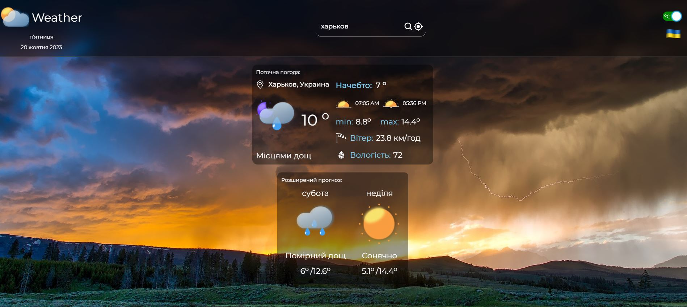

# React Weather App

Этот мультиязычный Pet-проект написан с помощью React, Redux, redux-persist, axios, tailwindcss, framer-motion, i18n и др.

[Погодный API - www.weatherapi.com](https://www.weatherapi.com/)

Перед началом работы с приложением создайте в корне файл `.env` с переменной `REACT_APP_API_KEY`.

После регистрации на погодном API, укажите полученный ключ в переменной `REACT_APP_API_KEY`.

Устанавливаем зависимости `npm i` или `npm install`.

Запускаем проект `npm start`.
